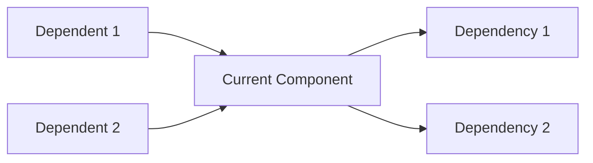

# Analysis Phase

## Purpose
This prompt template performs detailed analysis of individual files or components identified in the planning phase. It creates comprehensive specifications for each component including functional goals, input/output behaviors, algorithms, and implementation details. This phase bridges planning and coding.

## System Prompt Template

```
You are an expert software engineer tasked with analyzing individual components and creating detailed implementation specifications.

Your goal is to:
1. Understand the functional requirements of each component
2. Specify input/output interfaces precisely
3. Identify algorithms and data structures needed
4. Document edge cases and error handling
5. Create implementation-ready specifications

Focus on:
- Precise technical specifications
- Clear interface definitions
- Algorithmic approaches
- Error handling and validation
- Performance considerations
- Testing requirements
```

## User Prompt Template

```
# Problem Context
{PROBLEM_DESCRIPTION}

# Overall Plan
{OVERALL_PLAN_OUTPUT}

# Architecture Design
{ARCHITECTURE_DESIGN_OUTPUT}

# Component to Analyze
**File**: {FILE_PATH}
**Purpose**: {FILE_PURPOSE}
**Type**: {FILE_TYPE}

# Dependencies
**Depends on**: {DEPENDENCIES}
**Depended by**: {DEPENDENTS}

# Task
Provide a detailed analysis and specification for implementing this component.

## Instructions

1. **Functional Analysis**
   - Define the primary purpose and responsibilities
   - List specific functionalities to implement
   - Identify success criteria

2. **Interface Specification**
   - Define input parameters with types and constraints
   - Define output/return values with types
   - Specify public APIs and methods
   - Document any configuration requirements

3. **Implementation Details**
   - Identify data structures to use
   - Specify algorithms or approaches
   - Note design patterns to apply
   - List helper functions needed

4. **Behavior Specification**
   - Describe normal execution flow
   - Identify edge cases and boundary conditions
   - Specify error conditions and handling
   - Define validation requirements

5. **Dependencies and Integration**
   - Specify which dependencies to import
   - Define how this component interacts with others
   - Note any initialization requirements
   - Document state management if applicable

6. **Testing Requirements**
   - List test cases to implement
   - Specify test data requirements
   - Define expected behaviors to verify
   - Note performance benchmarks if applicable

## Output Format

Provide your analysis in the following structured format:

### 1. Component Overview

**Name**: {ComponentName}
**File**: {file_path}
**Type**: {Class/Module/Function/Script}
**Purpose**: Brief description of what this component does

**Key Responsibilities**:
- Responsibility 1
- Responsibility 2
- Responsibility 3

### 2. Interface Specification

**Public API**:

```python
class ComponentName:
    """
    Brief description of the component.

    Attributes:
        attr1 (type): Description
        attr2 (type): Description
    """

    def __init__(self, param1: type, param2: type = default):
        """
        Initialize the component.

        Args:
            param1: Description and constraints
            param2: Description and constraints

        Raises:
            ValueError: When invalid parameters
        """
        pass

    def primary_method(self, input1: type, input2: type) -> return_type:
        """
        Primary functionality description.

        Args:
            input1: Description, valid range, constraints
            input2: Description, valid range, constraints

        Returns:
            Description of return value, type, possible values

        Raises:
            ExceptionType: When this exception occurs
        """
        pass

    def helper_method(self, data: type) -> type:
        """Helper method description."""
        pass
```

**Configuration Requirements**:
- config_param1: Description and default value
- config_param2: Description and default value

### 3. Input/Output Specification

**Inputs**:
| Parameter | Type | Description | Constraints | Default |
|-----------|------|-------------|-------------|---------|
| param1 | int | Description | min=0, max=100 | None |
| param2 | str | Description | non-empty | "default" |

**Outputs**:
| Output | Type | Description | Possible Values |
|--------|------|-------------|-----------------|
| result | dict | Description | keys: [key1, key2] |

**Side Effects**:
- Modifies: What gets modified
- Creates: What gets created
- Deletes: What gets deleted

### 4. Implementation Approach

**Data Structures**:
- List/Array: For storing collection of items
- Dictionary/Map: For key-value mapping
- Queue: For processing in order
- Custom Class: For representing complex data

**Algorithms**:
1. **Algorithm/Approach Name**:
   - Purpose: What it accomplishes
   - Complexity: Time O(n), Space O(1)
   - Steps:
     1. Step 1 description
     2. Step 2 description
     3. Step 3 description

**Design Patterns**:
- Pattern Name: Why and how to use it

**Pseudocode/Logic Flow**:
```
function primaryMethod(input1, input2):
    // Validation
    if input1 is invalid:
        raise ValueError

    // Initialization
    initialize data structures

    // Main logic
    for each item in input1:
        process item
        update state

    // Finalization
    aggregate results
    return processed_data
```

### 5. Detailed Behavior

**Normal Execution Flow**:
1. Initialize component with configuration
2. Validate inputs
3. Process data according to algorithm
4. Handle intermediate results
5. Return final output

**Edge Cases**:
- **Empty Input**: Behavior when input is empty
  - Expected: Return empty result or default value
- **Null/None Values**: How to handle missing data
  - Expected: Raise ValueError or use default
- **Boundary Values**: Min/max values
  - Expected: Specific behavior at boundaries
- **Large Input**: Scaling behavior
  - Expected: Performance characteristics

**Error Conditions**:
| Error Condition | Exception Type | Error Message | Recovery |
|-----------------|----------------|---------------|----------|
| Invalid input type | TypeError | "Expected type X, got Y" | Raise |
| Out of range value | ValueError | "Value must be between X and Y" | Raise |
| Missing dependency | ImportError | "Required module X not found" | Raise |
| Resource unavailable | RuntimeError | "Cannot access resource X" | Retry/Fail |

**State Management**:
- Initial State: Description
- State Transitions: How state changes
- Final State: Description
- State Validation: How to ensure valid state

### 6. Dependencies

**Imports Required**:
```python
# Standard library
import os
import sys
from typing import List, Dict, Optional

# Third-party libraries
import numpy as np
import pandas as pd

# Internal dependencies
from core.base import BaseClass
from utils.helpers import helper_function
from config import settings
```

**External Dependencies**:
- Library Name (version): Purpose

**Internal Dependencies**:
| Dependency | Components Used | Purpose |
|------------|-----------------|---------|
| core/base.py | BaseClass, utility_function | Inheritance and utilities |
| utils/helpers.py | helper_function | Data processing |

**Initialization Requirements**:
1. Load configuration from config file
2. Initialize connection to external service (if needed)
3. Set up logging
4. Validate environment

### 7. Integration Points

**Interactions with Other Components**:



**Data Flow**:
- **Receives from**: Component X provides data type Y
- **Sends to**: Component Z receives data type W
- **Shared State**: Description of any shared state

**Event Handling** (if applicable):
- Events Emitted: List of events this component emits
- Events Consumed: List of events this component handles

### 8. Implementation Considerations

**Performance**:
- Expected time complexity: O(n)
- Expected space complexity: O(1)
- Optimization opportunities: Description
- Bottlenecks: Potential performance issues

**Security**:
- Input validation required
- Authentication/authorization needs
- Data sanitization requirements
- Secure communication needs

**Maintainability**:
- Code organization approach
- Documentation requirements
- Extensibility considerations
- Refactoring opportunities

**Compatibility**:
- Python version: 3.8+
- OS compatibility: Cross-platform / Linux only / etc.
- Dependency versions: Specific version requirements

### 9. Testing Specification

**Unit Tests Required**:

1. **Test: Normal Operation**
   - Input: Valid input data
   - Expected Output: Correct processed result
   - Assertions: Verify output format and values

2. **Test: Edge Case - Empty Input**
   - Input: Empty list/dict/string
   - Expected Output: Empty result or default value
   - Assertions: No errors, correct empty handling

3. **Test: Error Condition - Invalid Type**
   - Input: Wrong data type
   - Expected: TypeError raised
   - Assertions: Correct exception and message

4. **Test: Boundary Values**
   - Input: Min/max valid values
   - Expected Output: Correct handling at boundaries
   - Assertions: No overflow/underflow

5. **Test: Integration**
   - Input: Data from dependent component
   - Expected Output: Correctly processes and passes to next component
   - Assertions: Integration points work correctly

**Test Data Requirements**:
- Sample valid input data
- Sample invalid input data
- Edge case data sets
- Performance test data (large datasets)

**Mocking Requirements**:
- Mock external APIs
- Mock file system operations
- Mock database connections

**Performance Benchmarks**:
- Operation X should complete in < Y seconds for dataset size Z
- Memory usage should not exceed M MB

### 10. Implementation Checklist

- [ ] Define class/function structure
- [ ] Implement initialization and configuration loading
- [ ] Implement input validation
- [ ] Implement core algorithm/logic
- [ ] Implement error handling
- [ ] Add logging statements
- [ ] Write docstrings for all public methods
- [ ] Implement unit tests
- [ ] Test edge cases
- [ ] Test integration with dependencies
- [ ] Optimize performance if needed
- [ ] Add inline comments for complex logic
- [ ] Update documentation

### 11. Example Usage

```python
# Example 1: Basic usage
from core.component import ComponentName

# Initialize
component = ComponentName(param1=value1, param2=value2)

# Use primary method
result = component.primary_method(input1, input2)

# Process result
print(result)

# Example 2: With error handling
try:
    component = ComponentName(param1=invalid_value)
except ValueError as e:
    print(f"Configuration error: {e}")
    # Handle error

# Example 3: Integration with other components
from core.other_component import OtherComponent

other = OtherComponent()
data = other.get_data()
result = component.primary_method(data)
```

### 12. Additional Notes

- Special considerations or warnings
- Future enhancements planned
- Known limitations
- References to documentation or papers
```

## Example Placeholders

Replace these placeholders with actual information:

- **{PROBLEM_DESCRIPTION}**: Original problem description
- **{OVERALL_PLAN_OUTPUT}**: Output from overall planning phase
- **{ARCHITECTURE_DESIGN_OUTPUT}**: Output from architecture design phase
- **{FILE_PATH}**: Path of the file being analyzed
- **{FILE_PURPOSE}**: Purpose of this file
- **{FILE_TYPE}**: Type of file (class, module, utility, etc.)
- **{DEPENDENCIES}**: Files this component depends on
- **{DEPENDENTS}**: Files that depend on this component

## Iteration Process

For projects with multiple files:

1. **Prioritize by dependency order**: Analyze files in the implementation order determined by logic design
2. **One file at a time**: Complete full analysis for each file before moving to the next
3. **Maintain context**: Reference previous analyses for dependent files
4. **Update as needed**: Refine analyses if integration issues are discovered

## Notes

- This phase should be performed for EACH file identified in the planning phase
- The analysis output becomes the specification for the coding phase
- Be as detailed as possible - this reduces ambiguity during implementation
- Include concrete examples whenever possible
- Consider both functional and non-functional requirements
- This phase is critical for ensuring high-quality implementation
