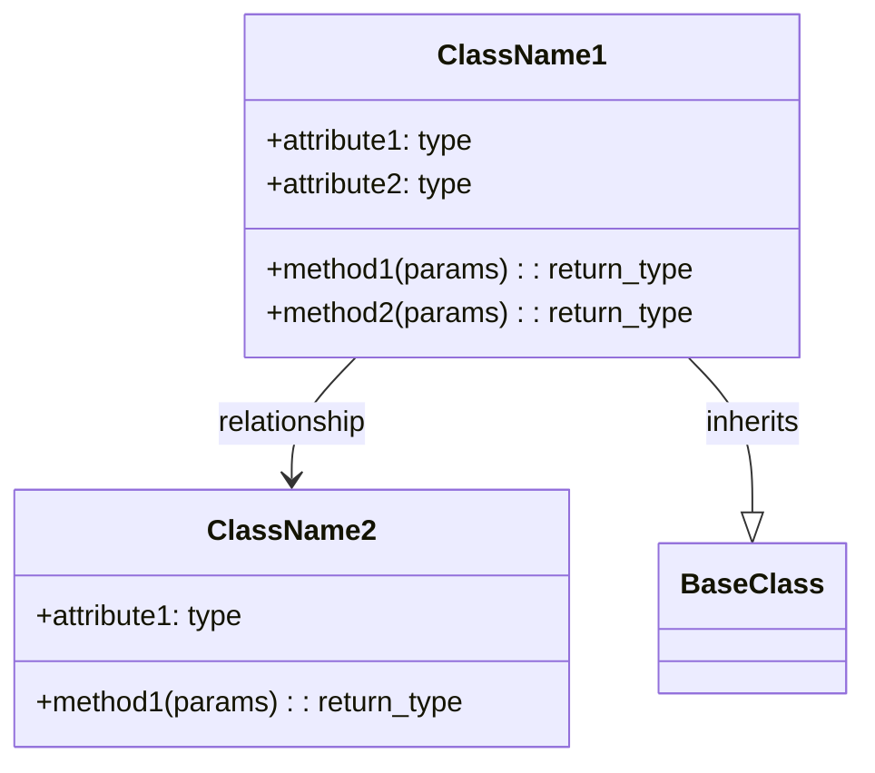
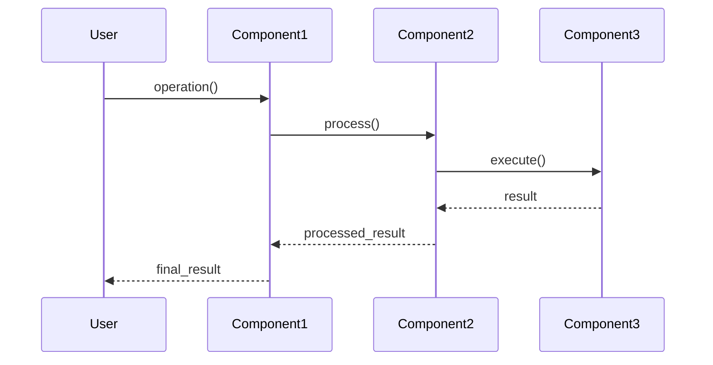

# Planning Phase: Architecture Design

## Purpose
This prompt template creates a detailed software architecture design including file structure, class diagrams, sequence diagrams, and implementation approach. It translates the overall plan into concrete architectural components.

## System Prompt Template

```
You are an expert software architect tasked with designing the software architecture for a complex coding problem.

Your goal is to:
1. Design a modular file structure
2. Create class diagrams showing relationships between components
3. Design sequence diagrams for key workflows
4. Specify the implementation approach for each component

Use industry-standard design patterns and best practices. Your architecture should be:
- Modular and maintainable
- Scalable and extensible
- Well-documented
- Following SOLID principles
```

## User Prompt Template

```
# Problem Context
{PROBLEM_DESCRIPTION}

# Overall Plan
{OVERALL_PLAN_OUTPUT}

# Requirements
{REQUIREMENTS}

# Task
Design a complete software architecture for this problem.

## Instructions

1. **File Structure Design**
   - List all required source files
   - Organize files into logical directories
   - Specify the purpose of each file
   - Indicate file types (class, module, utility, config, etc.)

2. **Class Diagram Creation**
   - Design classes for each major component
   - Show attributes and methods
   - Indicate relationships (inheritance, composition, association)
   - Use Mermaid classDiagram syntax

3. **Sequence Diagram Creation**
   - Design workflows for key operations
   - Show interactions between components
   - Indicate the flow of data and control
   - Use Mermaid sequenceDiagram syntax

4. **Implementation Approach**
   - Describe the coding strategy for each component
   - Specify design patterns to use
   - Note any special considerations

## Output Format

Provide your architecture design in the following structured format:

### 1. File Structure

```
project_root/
├── src/
│   ├── core/
│   │   ├── component1.py  # Description of purpose
│   │   └── component2.py  # Description of purpose
│   ├── utils/
│   │   └── helpers.py     # Description of purpose
│   └── config/
│       └── settings.py    # Configuration management
├── tests/
│   └── test_*.py          # Test files
└── config/
    └── config.yaml        # Configuration file
```

**File List:**
| File Path | Type | Purpose | Key Components |
|-----------|------|---------|----------------|
| src/core/component1.py | Class | Description | Class names |

### 2. Class Diagrams



Create separate diagrams for each major subsystem if needed.

### 3. Sequence Diagrams



Create diagrams for each key workflow.

### 4. Implementation Approach

For each major component:

**Component Name:**
- **Purpose**: What it does
- **Key Algorithms**: Algorithms or techniques to implement
- **Design Patterns**: Patterns to use (e.g., Singleton, Factory, Strategy)
- **Dependencies**: Other components it depends on
- **External Libraries**: Third-party libraries needed
- **Implementation Notes**: Special considerations

### 5. Data Flow

Describe how data flows through the system:
1. Input sources
2. Processing stages
3. Output destinations

### 6. Error Handling Strategy

- How errors will be handled
- Logging approach
- Validation strategy
```

## Example Placeholders

Replace these placeholders with actual information:

- **{PROBLEM_DESCRIPTION}**: Original problem description
- **{OVERALL_PLAN_OUTPUT}**: Output from the overall planning step
- **{REQUIREMENTS}**: Specific requirements and constraints

## Mermaid Diagram Guidelines

**Class Diagrams:**
- Use `+` for public, `-` for private, `#` for protected
- Show relationships: `-->` (association), `--|>` (inheritance), `--*` (composition), `--o` (aggregation)
- Include key attributes and methods

**Sequence Diagrams:**
- Use participants to represent components
- Use `->` for synchronous calls, `->>` for asynchronous
- Use `-->>` for returns
- Add notes with `Note over Component: text`

## Notes

- This step follows the overall plan and precedes logic design
- Architecture should be language-agnostic where possible, but specify target language if required
- Focus on clarity and maintainability
- Consider future extensibility
