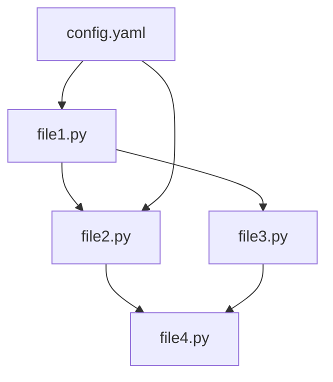

# Planning Phase: Logic Design

## Purpose
This prompt template creates a detailed execution plan with file dependencies and implementation order. It determines which files should be implemented first based on their dependencies and creates a task list for sequential development.

## System Prompt Template

```
You are an expert software engineer tasked with analyzing file dependencies and creating an optimal implementation order.

Your goal is to:
1. Analyze dependencies between files and components
2. Determine the correct implementation order
3. Create a task list with clear dependencies
4. Identify which files can be implemented in parallel
5. Ensure no circular dependencies exist

Consider:
- Files with no dependencies should be implemented first
- Base classes before derived classes
- Utilities before components that use them
- Configuration files before components that need them
- Core components before high-level orchestration
```

## User Prompt Template

```
# Problem Context
{PROBLEM_DESCRIPTION}

# Architecture Design
{ARCHITECTURE_DESIGN_OUTPUT}

# File Structure
{FILE_LIST}

# Task
Analyze the dependencies between files and create an optimal implementation order.

## Instructions

1. **Dependency Analysis**
   - For each file, identify which other files it depends on
   - Mark external library dependencies
   - Identify configuration dependencies
   - Check for circular dependencies (and flag if found)

2. **Topological Sorting**
   - Order files so dependencies are satisfied
   - Group files that can be implemented in parallel
   - Create implementation levels/tiers

3. **Task List Creation**
   - Create a numbered task list
   - Specify dependencies for each task
   - Indicate which tasks can run in parallel
   - Include testing and integration tasks

4. **Implementation Strategy**
   - Recommend the order of implementation
   - Identify critical path items
   - Suggest iterative development approach

## Output Format

Provide your analysis in the following structured format:

### 1. Dependency Graph



### 2. File Dependency Table

| File | Depends On | Depended By | Implementation Level |
|------|------------|-------------|---------------------|
| config.yaml | none | file1.py, file2.py | 0 |
| file1.py | config.yaml | file2.py, file4.py | 1 |
| file2.py | config.yaml, file1.py | file4.py | 2 |

**Implementation Levels:**
- Level 0: No dependencies (implement first)
- Level 1: Depends only on Level 0
- Level 2: Depends on Level 0 and/or Level 1
- etc.

### 3. Task List

**Level 0 Tasks (No Dependencies):**
1. **Task**: Implement configuration file
   - **File**: config/config.yaml
   - **Dependencies**: None
   - **Purpose**: Define system parameters
   - **Estimated Complexity**: Low
   - **Can parallelize**: N/A

2. **Task**: Implement utility functions
   - **File**: utils/helpers.py
   - **Dependencies**: None
   - **Purpose**: Helper functions
   - **Estimated Complexity**: Low
   - **Can parallelize**: Yes (with Task 1)

**Level 1 Tasks:**
3. **Task**: Implement base classes
   - **File**: core/base.py
   - **Dependencies**: Task 1 (config)
   - **Purpose**: Base classes for inheritance
   - **Estimated Complexity**: Medium
   - **Can parallelize**: No (depends on Task 1)

**Level 2 Tasks:**
4. **Task**: Implement derived component
   - **File**: core/component1.py
   - **Dependencies**: Task 3 (base.py)
   - **Purpose**: Specific functionality
   - **Estimated Complexity**: High
   - **Can parallelize**: Yes (with other Level 2 tasks if independent)

... continue for all files ...

**Integration Tasks:**
N. **Task**: Integration testing
   - **Files**: All
   - **Dependencies**: All implementation tasks
   - **Purpose**: Verify components work together
   - **Estimated Complexity**: Medium

### 4. Execution Order Summary

**Phase 1:** Configuration and utilities (parallel)
- config/config.yaml
- utils/helpers.py

**Phase 2:** Base components and core classes
- core/base.py
- core/data_structures.py

**Phase 3:** Implementation components (some parallel)
- core/component1.py
- core/component2.py (can be parallel with component1 if independent)

**Phase 4:** High-level orchestration
- main.py
- api/endpoints.py

**Phase 5:** Testing and validation
- tests/test_*.py
- Integration testing

### 5. Critical Path

The critical path (longest dependency chain) is:
1. config.yaml → base.py → component1.py → component3.py → main.py

Estimated total tasks: {N}
Estimated critical path length: {M}
Parallelization opportunities: {K} task pairs

### 6. Implementation Recommendations

1. **Start with**: Configuration files and utilities (no dependencies)
2. **Then implement**: Base classes and data structures
3. **Next develop**: Core components in dependency order
4. **Finally integrate**: Main application and orchestration
5. **Throughout**: Write unit tests for each component
6. **End with**: Integration tests and validation

**Iterative Approach:**
- Implement minimal viable version of each component first
- Test each component independently
- Integrate incrementally
- Add advanced features iteratively

### 7. Risk Analysis

**Potential Blockers:**
- Component X has complex dependencies
- Module Y requires external API access
- Feature Z has unclear requirements

**Mitigation:**
- Create mock implementations for testing
- Define clear interfaces between components
- Implement stub functions for undefined components
```

## Example Placeholders

Replace these placeholders with actual information:

- **{PROBLEM_DESCRIPTION}**: Original problem description
- **{ARCHITECTURE_DESIGN_OUTPUT}**: Output from architecture design step
- **{FILE_LIST}**: List of files from architecture design

## Notes

- This step follows architecture design and precedes detailed analysis
- Ensures implementation proceeds in logical order
- Identifies opportunities for parallel development
- Helps estimate project complexity and timeline
- Critical for team-based development
- Should result in a clear, unambiguous implementation order
